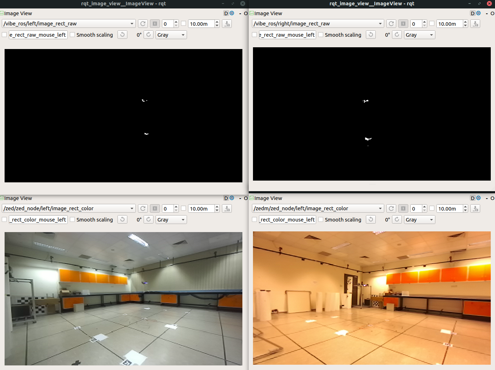

## Experiment Setup

Using NWU coordinate conventions:
Left camera is placed at `(0,0,0)`, heading 204 degree.
Right camera is placed approximately at `(-1,-5,0)`, heading 109 degree.

## Dataset Details

The left and right camera data are time synchronised using approximate sync policy.

Each camera is recorded on different computers, using its own Unit time.

**Note**: The .bag file is compressed by --lz4 option, but MATLAB does not support reading compressed .bag file. Hence, for MATLAB use, please use the dataset in the .zip file instead.

### Run 1

```
path:         vibe_0322_run1.bag
version:      2.0
duration:     55.9s
start:        Mar 25 2020 11:20:48.03 (1585106448.03)
end:          Mar 25 2020 11:21:43.89 (1585106503.89)
size:         2.3 MB
messages:     3352
compression:  lz4 [419/419 chunks; 0.51%]
uncompressed: 404.6 MB @  7.2 MB/s
compressed:     2.1 MB @ 37.6 KB/s (0.51%)
types:        sensor_msgs/CameraInfo [c9a58c1b0b154e0e6da7578cb991d214]
              sensor_msgs/Image      [060021388200f6f0f447d0fcd9c64743]
topics:       /vibe_ros/left/camera_info       838 msgs    : sensor_msgs/CameraInfo
              /vibe_ros/left/image_rect_raw    838 msgs    : sensor_msgs/Image     
              /vibe_ros/right/camera_info      838 msgs    : sensor_msgs/CameraInfo
              /vibe_ros/right/image_rect_raw   838 msgs    : sensor_msgs/Image
```

### Run 2

```
path:         vibe_0322_run2.bag
version:      2.0
duration:     1:16s (76s)
start:        Mar 25 2020 11:27:26.85 (1585106846.85)
end:          Mar 25 2020 11:28:43.73 (1585106923.73)
size:         2.4 MB
messages:     3672
compression:  lz4 [459/459 chunks; 0.50%]
uncompressed: 443.3 MB @  5.8 MB/s
compressed:     2.2 MB @ 29.3 KB/s (0.50%)
types:        sensor_msgs/CameraInfo [c9a58c1b0b154e0e6da7578cb991d214]
              sensor_msgs/Image      [060021388200f6f0f447d0fcd9c64743]
topics:       /vibe_ros/left/camera_info       918 msgs    : sensor_msgs/CameraInfo
              /vibe_ros/left/image_rect_raw    918 msgs    : sensor_msgs/Image     
              /vibe_ros/right/camera_info      918 msgs    : sensor_msgs/CameraInfo
              /vibe_ros/right/image_rect_raw   918 msgs    : sensor_msgs/Image
```

### Calibration
```
/zed/zed_node/left/camerinfo
header: 
  seq: 4479
  stamp: 
    secs: 1584868041
    nsecs: 609379320
  frame_id: "zed_left_camera_optical_frame"
height: 376
width: 672
distortion_model: "plumb_bob"
D: [0.0, 0.0, 0.0, 0.0, 0.0]
K: [263.76385498046875, 0.0, 343.8626708984375, 0.0, 263.76385498046875, 185.25424194335938, 0.0, 0.0, 1.0]
R: [1.0, 0.0, 0.0, 0.0, 1.0, 0.0, 0.0, 0.0, 1.0]
P: [263.76385498046875, 0.0, 343.8626708984375, 0.0, 0.0, 263.76385498046875, 185.25424194335938, 0.0, 0.0, 0.0, 1.0, 0.0]
binning_x: 0
binning_y: 0
roi: 
  x_offset: 0
  y_offset: 0
  height: 0
  width: 0
  do_rectify: False
---
```

```
/zedm/zed_node/left/camera_info
header: 
  seq: 9348
  stamp: 
    secs: 1584868042
    nsecs: 585011564
  frame_id: "zedm_left_camera_optical_frame"
height: 376
width: 672
distortion_model: "plumb_bob"
D: [0.0, 0.0, 0.0, 0.0, 0.0]
K: [331.7231140136719, 0.0, 317.70501708984375, 0.0, 331.7231140136719, 193.75619506835938, 0.0, 0.0, 1.0]
R: [1.0, 0.0, 0.0, 0.0, 1.0, 0.0, 0.0, 0.0, 1.0]
P: [331.7231140136719, 0.0, 317.70501708984375, 0.0, 0.0, 331.7231140136719, 193.75619506835938, 0.0, 0.0, 0.0, 1.0, 0.0]
binning_x: 0
binning_y: 0
roi: 
  x_offset: 0
  y_offset: 0
  height: 0
  width: 0
  do_rectify: False
---
```


### Converting lz4 Compressed Bag File to .zip

``` bash
rosbag decompress <bag> | 
zip <bag_decompressed_name> <bag>
```


### Screenshots
